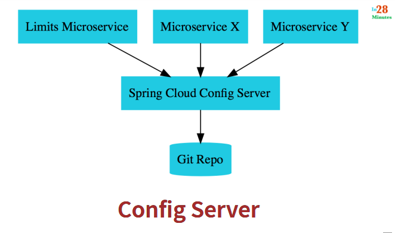

# spring-cloud-config-server
Getting started with Spring Cloud Config Server for Microservices
Modifying configuration in ```application.properties```



source : https://courses.in28minutes.com/p/master-microservices-with-spring-boot-and-spring-cloud 


